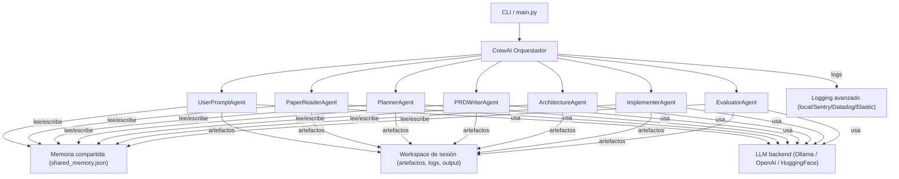

# Paper-to-Prod CrewAI


[](https://codecov.io/gh/<TU_USUARIO>/<TU_REPO>)

## Descripción

Este proyecto implementa un flujo automatizado basado en agentes CrewAI para transformar papers científicos en entregables de producto (PRD, arquitectura, código y evaluación).

## Estructura de agentes y tareas

- UserPromptAgent: Inicializa sesión y almacena prompt/paper.
- PaperReaderAgent: Extrae texto y estructura del paper.
- PlannerAgent: Define plan de tareas y dependencias.
- PRDWriterAgent: Genera el PRD en Markdown.
- ArchitectureAgent: Produce arquitectura técnica y diagrama.
- ImplementerAgent: Genera esqueleto backend/frontend.
- EvaluatorAgent: Evalúa entregables.

## Ejecución

1. Instala dependencias:
   ```
   pip install -r requirements.txt
   ```
2. Ejecuta el flujo principal:
   ```
   python main.py
   ```

## Opciones de Ejecución con Makefile

El Makefile provee varias tareas para facilitar la ejecución del proyecto:

- **run:** Ejecuta el flujo principal.
- **run-crew:** Ejecuta el flujo con la bandera `--crew`.
- **debug-file:** Verifica la existencia y formato del archivo de entrada.
- **clean:** Elimina todos los workspaces y sesiones.
- **install:** Instala las dependencias.
- **setup:** Ejecuta configuraciones iniciales.
- **test:** Ejecuta los tests con pytest.
- **lint:** Ejecuta el linter (ruff).
- **test-ollama:** Prueba la conexión al backend LLM (Ollama).
- **venv:** Crea el entorno virtual.
- **all:** Realiza de forma secuencial: venv, setup e install.

Puedes sobrescribir variables al invocar make. Ejemplo:
```
make run LLM=ollama LOG_SYSTEM=sentry PROMPT="Tu prompt" PAPER="/ruta/a/tu/paper.pdf"
```

## Memoria compartida entre agentes

El sistema implementa una memoria compartida simple basada en archivos JSON, ubicada en `sessions/<session_id>/intermediate/shared_memory.json`.  
Cada agente puede leer y escribir información relevante en esta memoria, lo que permite compartir contexto y resultados intermedios entre agentes durante la ejecución de CrewAI.

### Ejemplo de uso

```python
from utils.shared_memory import SharedMemory

memory = SharedMemory(session_path)
memory.write("llave", "valor")
valor = memory.get("llave")
```

Puedes inspeccionar el archivo `shared_memory.json` para ver el estado de la memoria durante o después de la ejecución.

## Flujo CrewAI avanzado

El flujo CrewAI orquesta los siguientes agentes y tareas:

1. **UserPromptAgent**: Inicializa la sesión y almacena prompt/paper.
2. **PaperReaderAgent**: Extrae texto y estructura del paper.
3. **PlannerAgent**: Define el plan de desarrollo usando la estructura extraída.
4. **PRDWriterAgent**: Genera el PRD en Markdown.
5. **ArchitectureAgent**: Produce la arquitectura técnica y diagrama Mermaid.
6. **ImplementerAgent**: Genera el esqueleto backend y frontend.
7. **EvaluatorAgent**: Evalúa los entregables y produce un informe.

Cada agente puede acceder a la memoria compartida y a los artefactos intermedios de la sesión.

## Arquitectura del sistema



## Ciclo de vida de una sesión

1. **Inicio**:  
   Al ejecutar la CLI o el flujo principal, se crea un workspace único bajo `sessions/<session_id>/` con subcarpetas para artefactos intermedios, output y logs.

2. **Ejecución**:  
   Cada agente lee y escribe artefactos y contexto en el workspace de la sesión.  
   - Los archivos intermedios se guardan en `intermediate/`.
   - Los entregables finales se guardan en `output/`.
   - Los logs de la sesión se guardan en `logs/`.
   - La memoria compartida está en `intermediate/shared_memory.json`.

3. **Finalización**:  
   Al finalizar el flujo, todos los artefactos, logs y contexto quedan disponibles en el workspace de la sesión para inspección, depuración o reutilización.

4. **Limpieza**:  
   Puedes eliminar workspaces antiguos manualmente o mediante scripts si lo deseas.  
   Ejemplo:
   ```bash
   rm -rf sessions/2024*
   ```

## Limpieza de sesiones antiguas

Puedes usar el script utilitario para limpiar workspaces de sesiones antiguas:

```bash
python scripts/clean_sessions.py --days 14 --dry-run
python scripts/clean_sessions.py --days 30
```

- Usa `--dry-run` para ver qué se eliminaría sin borrar nada.
- Cambia `--days` para ajustar la antigüedad mínima de las sesiones a eliminar.

### Automatización con cron

Puedes programar la limpieza automática de sesiones antiguas usando `cron`.  
Ejemplo para limpiar sesiones de más de 30 días cada semana:

```
0 3 * * 0 cd /ruta/a/paper-to-prod && /ruta/a/tu/python scripts/clean_sessions.py --days 30
```

Asegúrate de ajustar las rutas a tu entorno.

## Recomendaciones de operación

- **Monitoreo:** Usa la integración de logging avanzado para enviar logs a tu sistema de monitoreo preferido.
- **Backups:** Realiza backups periódicos de la carpeta `sessions/` si necesitas trazabilidad histórica.
- **Actualizaciones:** Revisa el `CHANGELOG.md` y actualiza dependencias regularmente.
- **Seguridad:** Protege tus archivos `.env` y secrets, y sigue las buenas prácticas documentadas.
- **Escalabilidad:** Si necesitas ejecutar múltiples flujos en paralelo, asegúrate de que cada sesión tenga su propio workspace.

## Cobertura de tests

Este proyecto utiliza [Codecov](https://about.codecov.io/) para medir la cobertura de los tests.

- El badge de cobertura se actualiza automáticamente en cada push a `main`.
- Para activar Codecov:
  1. Registra tu repositorio en [https://codecov.io/](https://codecov.io/).
  2. Obtén tu `CODECOV_TOKEN` y agrégalo como secret en GitHub Actions (`Settings > Secrets and variables > Actions > New repository secret`).
  3. Verifica que el workflow de CI suba correctamente el archivo `coverage.xml`.

## Desarrollo y depuración

- Los logs de cada sesión se encuentran en `sessions/<session_id>/logs/run.log`.
- Si ocurre un error, revisa tanto el log como los artefactos intermedios para depuración.
- Puedes extender la memoria compartida agregando nuevas claves/valores según las necesidades de tus agentes.

## CLI para ejecución flexible

Puedes usar la CLI para seleccionar el backend LLM y el sistema de logging externo fácilmente:

```bash
python cli.py "Resume y genera un MVP del siguiente paper." tests/sample.pdf --crew --llm huggingface --log-system sentry
```

**Nota:**  
- Para HuggingFace, define `HF_API_TOKEN`.
- Para Sentry, define `SENTRY_DSN`.
- Para Datadog, define `DATADOG_API_KEY` y `DATADOG_APP_KEY`.
- Para Elastic, define `ELASTIC_URL` si no usas el valor por defecto.

Si falta alguna variable de entorno requerida, la CLI mostrará un mensaje de error claro.

## Configuración con archivo `.env`

Puedes definir todas las variables de entorno necesarias en un archivo `.env` en la raíz del proyecto.  
Por ejemplo, copia y renombra el archivo `.env.example` incluido:

```
cp .env.example .env
```

Edita el archivo `.env` con tus valores reales:

```
HF_API
```

## Integración continua

Este proyecto utiliza GitHub Actions para ejecutar automáticamente los tests en cada push o pull request a las ramas principales.

## Versionado y cambios

Este proyecto sigue [versionado semántico](https://semver.org/lang/es/).  
Consulta el archivo [`CHANGELOG.md`](CHANGELOG.md) para ver el historial de cambios y novedades de cada versión.

## Buenas prácticas de seguridad

- **Nunca subas tu archivo `.env` real a repositorios públicos.**
- Añade `.env` a tu archivo `.gitignore` para evitar filtraciones accidentales.
- Usa `.env.example` para compartir la estructura de configuración sin exponer datos sensibles.
- Cambia tus tokens y claves periódicamente y revoca los que no uses.
- Si usas sistemas de CI/CD, configura las variables sensibles en el entorno seguro del proveedor, no en el código fuente.

## Troubleshooting y FAQ

### El sistema no encuentra mi archivo `.env`
- Asegúrate de que el archivo `.env` esté en la raíz de `paper-to-prod`.
- Si no existe, copia `.env.example` y edítalo con tus valores.

### Error: "Debes definir la variable de entorno HF_API_TOKEN para usar HuggingFace"
- Añade tu token de HuggingFace en `.env` como `HF_API_TOKEN=...`.

### Error: "No se pudo conectar a Elasticsearch"
- Verifica que tu instancia de Elasticsearch esté corriendo y la URL sea correcta (`ELASTIC_URL`).

### Error: "CrewAI no está disponible o no se pudo importar"
- Asegúrate de haber instalado todas las dependencias (`pip install -r requirements.txt`).

### ¿Dónde están los logs y artefactos de cada sesión?
- En la carpeta `sessions/<session_id>/` encontrarás subcarpetas `output/`, `intermediate/` y `logs/`.

### ¿Cómo cambio el modelo LLM?
- Usa la CLI con `--llm` o define la variable de entorno `P2P_LLM_BACKEND`.

### ¿Cómo integro un sistema de logging externo?
- Usa la CLI con `--log-system` y configura las variables de entorno necesarias.

### ¿Cómo limpio sesiones antiguas?
- Borra manualmente las carpetas bajo `sessions/` que ya no necesites.

### ¿Cómo agrego un nuevo agente o tarea?
- Consulta la sección "Guía para desarrolladores" en este README.

## Extensión avanzada y personalización de pipelines

### Crear nuevos artefactos o agentes

- Define la lógica de tu nuevo agente o artefacto en un módulo aparte o en `agents/crew.py`.
- Usa la memoria compartida (`utils/shared_memory.py`) para compartir información entre agentes.
- Añade tu agente y tarea personalizada al flujo CrewAI en la lista de agentes y tareas.
- Puedes crear pipelines alternativos reutilizando agentes existentes y agregando nuevos pasos.

**Ejemplo:**
```python
def custom_summary_agent_logic(input_data):
    # Lógica personalizada para un resumen extendido
    memory = input_data.get("memory")
    # ...tu lógica...
    memory.write("custom_summary", "Resumen extendido generado.")

# Añade el agente y la tarea al flujo CrewAI
```

### Recomendaciones para personalización

- Mantén la estructura de carpetas y workspaces para asegurar trazabilidad.
- Usa la memoria compartida para evitar dependencias rígidas entre agentes.
- Añade tests para cualquier pipeline o agente nuevo.
- Documenta tus extensiones en un archivo aparte o en el README para facilitar el mantenimiento.
`